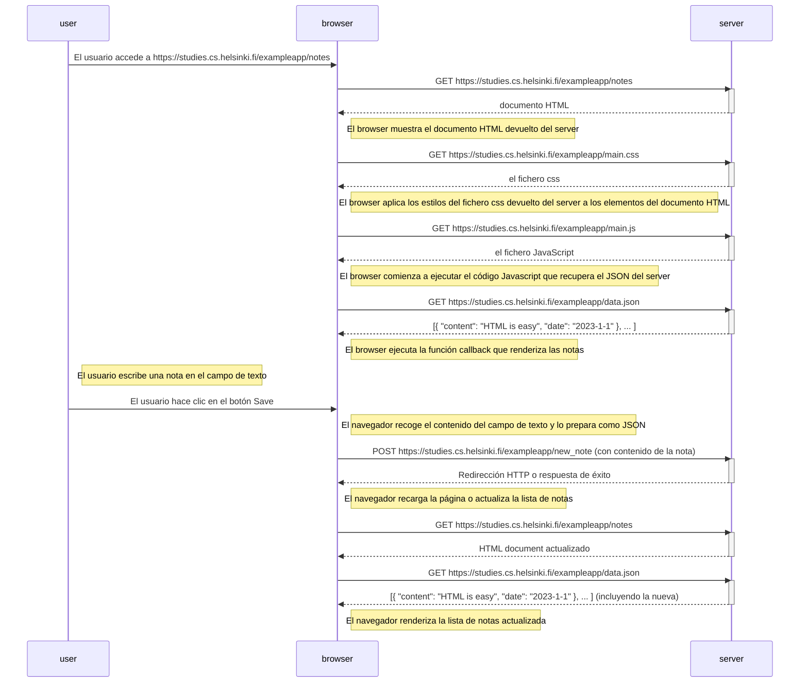

```mermaid
sequenceDiagram
    participant user
    participant browser
    participant server

    user->>browser: El usuario accede a https://studies.cs.helsinki.fi/exampleapp/notes
    
    browser->>server: GET https://studies.cs.helsinki.fi/exampleapp/notes
    activate server
    server-->>browser: documento HTML 
    deactivate server
    
    Note right of browser: El browser muestra el documento HTML devuelto del server
    
    browser->>server: GET https://studies.cs.helsinki.fi/exampleapp/main.css
    activate server
    server-->>browser: el fichero css
    deactivate server
    Note right of browser: El browser aplica los estilos del fichero css devuelto del server a los elementos del documento HTML

    browser->>server: GET https://studies.cs.helsinki.fi/exampleapp/main.js
    activate server
    server-->>browser: el fichero JavaScript
    deactivate server    

    Note right of browser: El browser comienza a ejecutar el código Javascript que recupera el JSON del server

    browser->>server: GET https://studies.cs.helsinki.fi/exampleapp/data.json
    activate server
    server-->>browser: [{ "content": "HTML is easy", "date": "2023-1-1" }, ... ]
    deactivate server

    Note right of browser: El browser ejecuta la función callback que renderiza las notas

    Note right of user: El usuario escribe una nota en el campo de texto

    user->>browser: El usuario hace clic en el botón Save
    Note right of browser: El navegador recoge el contenido del campo de texto y lo prepara como JSON

    browser->>server: POST https://studies.cs.helsinki.fi/exampleapp/new_note (con contenido de la nota)
    activate server
    server-->>browser: Redirección HTTP o respuesta de éxito
    deactivate server

    Note right of browser: El navegador recarga la página o actualiza la lista de notas

    browser->>server: GET https://studies.cs.helsinki.fi/exampleapp/notes
    activate server
    server-->>browser: HTML document actualizado
    deactivate server

    browser->>server: GET https://studies.cs.helsinki.fi/exampleapp/data.json
    activate server
    server-->>browser: [{ "content": "HTML is easy", "date": "2023-1-1" }, ... ] (incluyendo la nueva)
    deactivate server

    Note right of browser: El navegador renderiza la lista de notas actualizada
```
