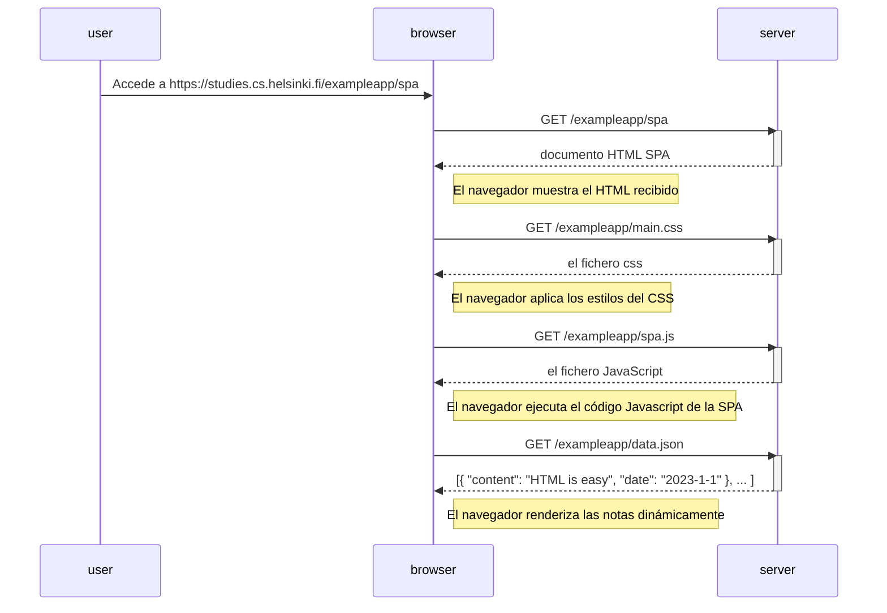

```mermaid
sequenceDiagram
    participant user
    participant browser
    participant server

    user->>browser: Accede a https://studies.cs.helsinki.fi/exampleapp/spa
    
    browser->>server: GET /exampleapp/spa
    activate server
    server-->>browser: documento HTML SPA
    deactivate server
    
    Note right of browser: El navegador muestra el HTML recibido
    
    browser->>server: GET /exampleapp/main.css
    activate server
    server-->>browser: el fichero css
    deactivate server
    Note right of browser: El navegador aplica los estilos del CSS

    browser->>server: GET /exampleapp/spa.js
    activate server
    server-->>browser: el fichero JavaScript
    deactivate server    

    Note right of browser: El navegador ejecuta el código Javascript de la SPA

    browser->>server: GET /exampleapp/data.json
    activate server
    server-->>browser: [{ "content": "HTML is easy", "date": "2023-1-1" }, ... ]
    deactivate server

    Note right of browser: El navegador renderiza las notas dinámicamente
```
